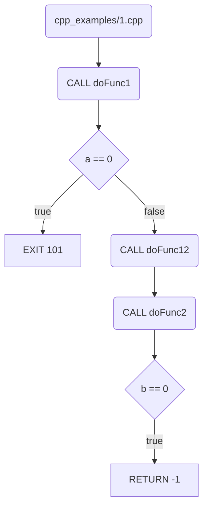

# cpp-source-mermaid-graph-generator


CPP program flow graph generator from source file (in mermaid format)

## Motivation
Mostly for faster reading and understanding legacy ANSI C code mixed with C++ code blocks.
I want to have not complicated first code level tool for myself, when output it in **mermaid** format.
This format gives me easy way to add comment in PRs and facts to README.md inside github - what works very well for me!

## How to run?

```bash
cargo run
Usage: target/debug/cpp_source_mermaid_graph_generator <source.cpp> [skip_list]
```

Two arguments:
- `<source.cpp>` (required) path to legacy CPP source file
- `[skip_list]` (optional) skip commands lists to not include to results (default: "cout,cin") 

### Run example

```bash
cargo run -- cpp_examples/1.cpp 
    Finished `dev` profile [unoptimized + debuginfo] target(s) in 0.02s
     Running `target/debug/cpp_source_mermaid_graph_generator cpp_examples/1.cpp`
flowchart TD
    START(cpp_examples/1.cpp)
    START --> F001
    F001(CALL doFunc1)
    F001 --> B002{a == 0}
    B002 -->|true| EXIT101[EXIT 101]
    B002 -->|false| F003
    F003(CALL doFunc12)
    F003 --> F004
    F004(CALL doFunc2)
    F004 --> B005{b == 0}
    B005 -->|true| RETN1[RETURN -1]
```

What is the valuable - you can put here to MarkDown file in github results, 
like that and automatically you can see graph representation.



